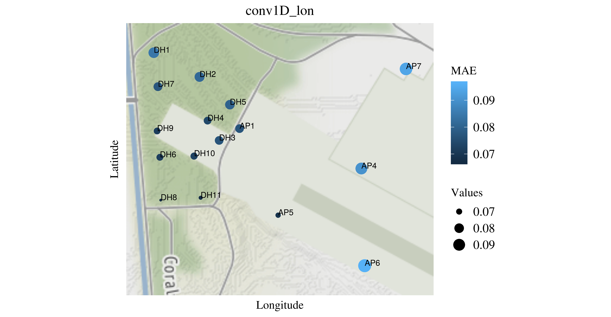
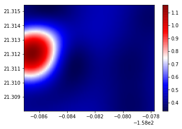
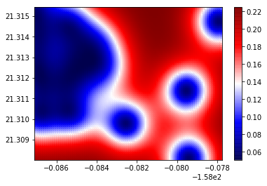
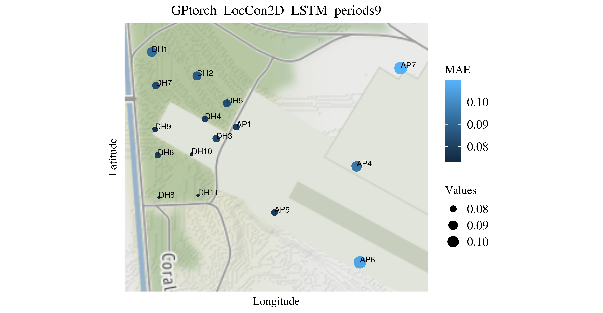
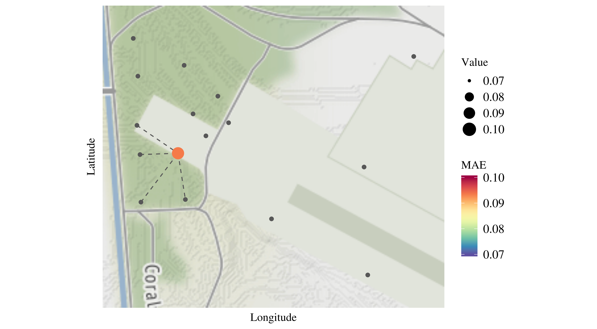
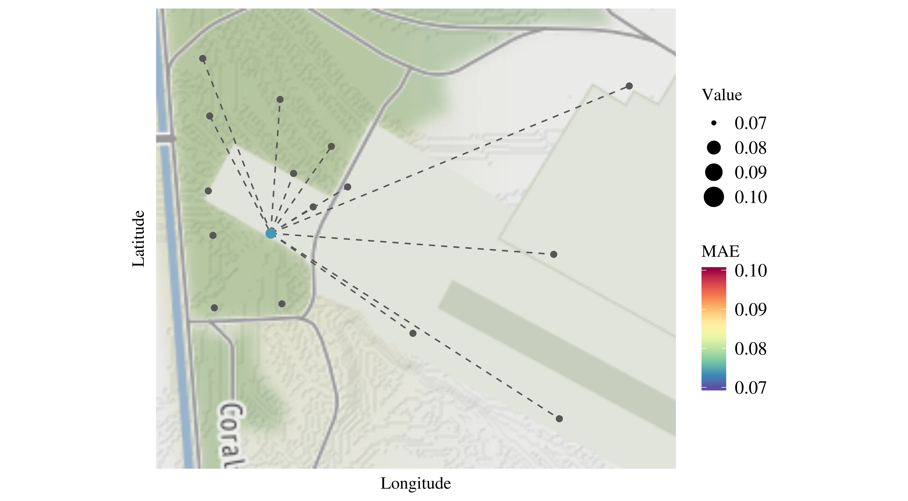
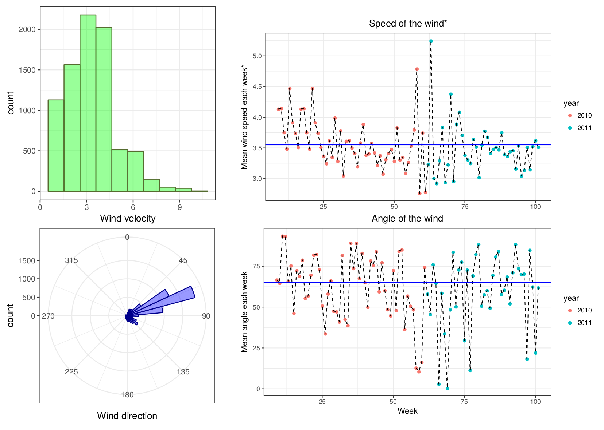

# Data preprocessing

* Original data from the [NREL](https://data.nrel.gov/submissions/11)

* Solar power plant based in Oahu, Hawaii
  
  1. Time resolution 1s
  
  2. 16 working sensors (we remove AP3)
  
*  Preprocessing:

  1. Resample data from 1s to 1m

  2. Set negative GHI to 0
  
  3. Filter always sunlight hours (7:30 - 17:30)

* Split:

  1. Training set: March 2010 - July 2011
  
  2. Test set: August 2011 - November 2011
  
---

## Clear sky models

* [Pysolar](https://pysolar.readthedocs.io/en/latest/) library

* [Pvlib](https://pvlib-python.readthedocs.io/en/stable/) library 

  1. Ineichen
  
  2. Haurwitz
  
  3. Simplified Solis

* Formulas taken from UCM codebase

  1. Haurwitz, $\text{GHI} = 910 \times \sin(\text{altitude})$
  
  2. Kasten, $\text{GHI} = 910 \times \sin(\text{altitude}) \times \exp(-0.057 / \sin(\text{altitude}))$


* After rescaling, data should be in [0, 1] range  
  
---

## Comparison between models

```{r echo=FALSE, message=FALSE, warning=FALSE}
library(dplyr)
cs <- read.table('../results/clearsky.txt')

cs %>%
  .[2:nrow(.),] %>%
  knitr::kable(., format = "html", digits=4)
```


---

## 1D Convolutional Model

* To predict each sensor, we use information of the rest. 

* We plot MAE for different sensors.



---

## GPs to create irradiance map

* Mean for different positions


---

## GPs to create irradiance map

* Variance for different positions



---

## Local 2D Convolutional Model

* Kriging to create irradiance map.

* Same spatial pattern.



---

## Effect of removing sensors

* We choose DH10 as target.

* Removing sensors in the North East, increases MAE.



---

## Effect of removing sensors

* Sensors in the South West, do not help in the prediction.

* Wind influence? SW-NE is precisely the average wind direction.




---

## Wind data



---

## Results

```{r echo=FALSE, message=FALSE, warning=FALSE}
library(dplyr)
library(tidyr)
data <- read.csv("../results/all.csv")

data %>%
  select(-Latitude, -Longitude) %>%
  summarize_if(is.numeric, mean) %>%
  gather(Model, Average_MAE) %>%
  arrange(Average_MAE) %>%
  knitr::kable(., format = "html", digits=4)
```


---

## Results on UCM data
